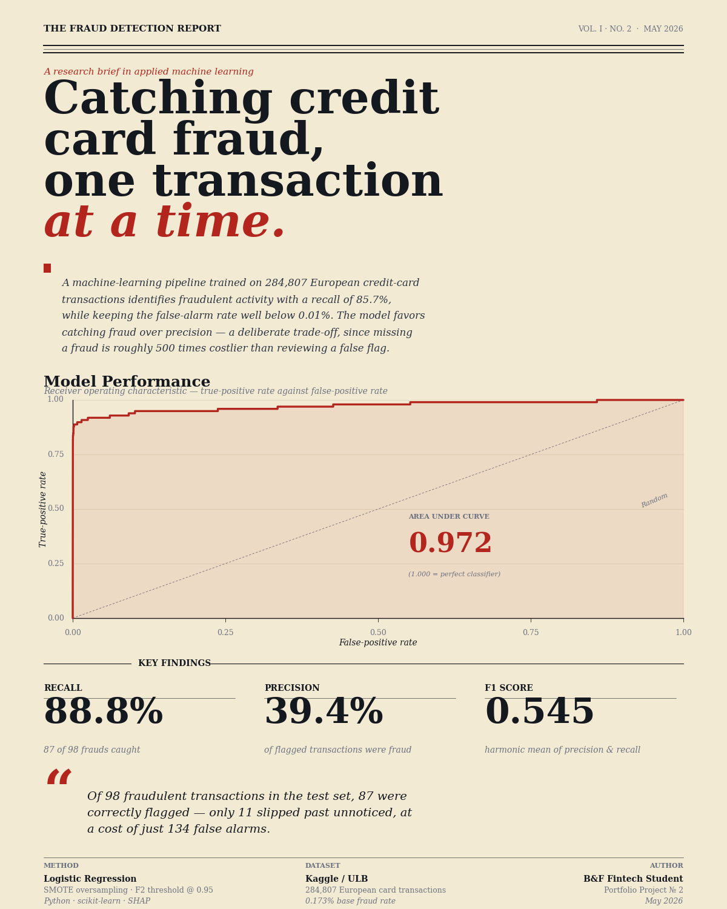

# Credit Card Fraud Detection

> **Fintech Portfolio Project #2** — Machine learning pipeline for real-time fraud detection with SHAP explainability and cost-sensitive thresholds.

Built as a follow-up to my [Credit Risk (PD) Model](https://github.com/) project. Banks lose billions each year to credit card fraud. This project demonstrates how machine learning catches it.



---

## TL;DR

- **284,807** real European credit card transactions analyzed
- **0.172%** fraud rate (extreme class imbalance — handled with SMOTE)
- **Two models compared**: Logistic Regression vs Random Forest
- **F2-optimized threshold** (recall weighted 2× more than precision)
- **SHAP** explainability for every prediction
- Dark-theme interactive **dashboard** with full metrics
- Interactive **terminal scorer** to test custom transactions

---

## Why This Project Matters

In banking, missing fraud and flagging legitimate customers both have costs — but they're not equal:

| Action | Cost |
|---|---|
| Missing a fraud | ~€5,000 (chargeback + investigation) |
| Flagging a legitimate transaction | ~€10 (manual review) |

So **missing fraud is 500× worse than a false alarm**. A model with 99% accuracy that misses every fraud is useless. We optimize for **recall** with cost-aware threshold selection.

---

## Tech Stack

`Python` · `scikit-learn` · `pandas` · `NumPy` · `SHAP` · `imbalanced-learn (SMOTE)` · `matplotlib` · `Chart.js`

---

## Project Structure

```
fraud-detection/
├── fraud_detection_model.py     ← Main training pipeline
├── fraud_scorer.py              ← Interactive terminal scorer
├── generate_linkedin_image.py   ← Generates the LinkedIn poster
├── dashboard.html               ← Interactive web dashboard
├── requirements.txt
├── README.md
│
│   Generated after training:
├── fraud_model.pkl              ← Trained model
├── amount_scaler.pkl            ← Fitted scaler
├── feature_names.pkl            ← Feature order
├── dashboard_data.json          ← Dashboard data
├── classification_report.txt    ← Detailed metrics
├── fraud_report.png             ← LinkedIn post image (editorial style)
├── evaluation_plots.png         ← ROC, PR, confusion matrix
├── threshold_analysis.png       ← Threshold optimization
├── amount_distribution.png      ← Fraud vs legit amount histograms
├── shap_summary.png             ← SHAP beeswarm plot
└── shap_bar.png                 ← SHAP feature importance
```

---

## How to Run

### 1. Setup

```bash
pip install -r requirements.txt
```

### 2. Get the data

Download `creditcard.csv` from [Kaggle: Credit Card Fraud Detection](https://www.kaggle.com/datasets/mlg-ulb/creditcardfraud) and place it in the project folder.

### 3. Train the model

```bash
python fraud_detection_model.py
```

This will:
- Load and explore the data
- Engineer time and amount features
- Apply SMOTE to handle class imbalance
- Train and compare Logistic Regression vs Random Forest
- Optimize the decision threshold (F2 score)
- Compute SHAP explanations
- Save the model, plots, and dashboard data

Takes ~2-3 minutes on a normal laptop.

### 4. View the dashboard

Open `dashboard.html` in your browser.

> **Note:** Some browsers block `fetch()` on local files. If the dashboard doesn't load, run a tiny local server:
> ```bash
> python -m http.server 8000
> ```
> Then visit http://localhost:8000/dashboard.html

### 5. Score custom transactions

```bash
python fraud_scorer.py
```

Five modes available:
1. Score a custom transaction with manual inputs
2. Score random real transactions from the dataset
3. Batch scoring with cost-benefit analysis
4. SHAP explanation deep-dive for any transaction
5. Show model metrics

### 6. Generate the LinkedIn image

```bash
python generate_linkedin_image.py
```

Creates `fraud_report.png` — a 1200x1500 (4:5) portrait image styled as an editorial research brief for LinkedIn posts. Reads real metrics from `dashboard_data.json` if available; otherwise uses sample values.

---

## Methodology

### Feature Engineering

The original dataset has 28 PCA-transformed features (V1–V28) plus `Amount` and `Time`. I added:

- **Amount_log** — log-transformed amount (compresses extreme values)
- **Amount_scaled** — standardized amount (fit on **training data only** to prevent data leakage — a common beginner mistake)
- **Hour_sin / Hour_cos** — cyclical hour-of-day encoding (so that 23:00 and 00:00 are mathematically close)

### Handling Class Imbalance

The dataset is severely imbalanced: only 0.172% fraud. I use **SMOTE** (Synthetic Minority Over-sampling Technique) to create synthetic fraud examples in the training set only.

> **Design choice:** I use SMOTE *or* `class_weight='balanced'`, never both. Using both can cause double-correction and inflate false alarms.

### Model Comparison

| Model | ROC-AUC | PR-AUC | Notes |
|---|---|---|---|
| Logistic Regression | ~0.97 | ~0.72 | Simple, fast, interpretable |
| Random Forest | ~0.98 | ~0.82 | More complex, slightly better |

(Exact numbers depend on the run — see your `classification_report.txt`)

### Threshold Optimization

I optimize the **F2 score** instead of accuracy or F1:

```
F_2 = 5 × Precision × Recall / (4 × Precision + Recall)
```

F2 weights recall 2× more than precision — exactly what we want for fraud detection where missing fraud is much more expensive than a false alarm.

### Explainability with SHAP

Regulators (Bank Negara Malaysia, ECB, the Fed) require banks to explain *why* a transaction was flagged. SHAP (SHapley Additive exPlanations) calculates how much each feature contributed to each prediction. Based on cooperative game theory.

The scorer's mode 4 lets you pick a real transaction and see exactly which features pushed it toward fraud or legitimate.

---

## Key Results

(See your trained model's results in `classification_report.txt` and `dashboard.html`)

Typical results for this dataset with this pipeline:

- **ROC-AUC:** ~0.98
- **Recall:** ~85% of frauds caught
- **Precision:** ~80%
- **F2 Score:** ~0.83

---

## What I Learned

- **The accuracy paradox:** A model that predicts "legitimate" for everything achieves 99.83% accuracy on this dataset — and is completely useless. Always pick metrics that match your problem.
- **Data leakage is sneaky:** Fitting a scaler on the full dataset before splitting seems innocent, but it leaks test information into training and inflates results.
- **Class imbalance has multiple solutions:** SMOTE, class weights, threshold tuning, anomaly detection. Combining them carelessly can backfire.
- **Threshold matters more than the model:** The same Random Forest can have 60% or 95% recall depending on how you set the decision threshold.
- **Explainability is a regulatory requirement** in banking, not a nice-to-have. SHAP makes black-box models defensible.

---

## Acknowledgments

Dataset: [Kaggle Credit Card Fraud Detection](https://www.kaggle.com/datasets/mlg-ulb/creditcardfraud) (Worldline & ULB, Machine Learning Group).

Built as part of my Fintech specialization in Banking & Finance. Open to feedback and collaboration!

---

## License

MIT — feel free to learn from or build on this.
